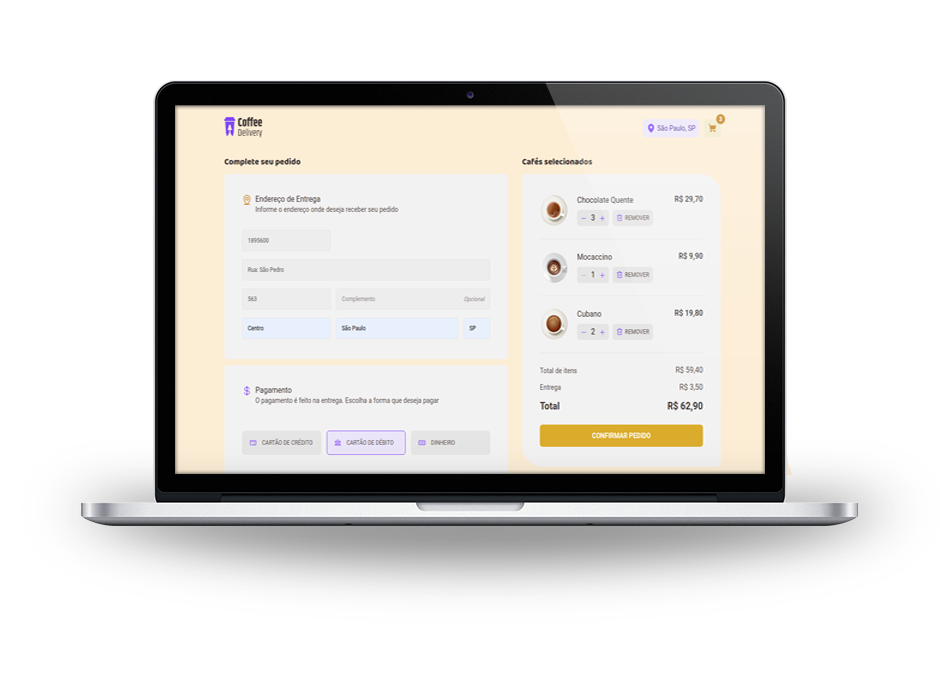

<h2 align="center">
  

    
  

</h2>
<h1 align="center">
  Coffee Delivery
</h1>

<h2 align="center">
  

    
  

</h2>

 Aplicação desenvolvida no segundo módulo da trilha de React do Ignite 💻🚀 

  <a href="##rocket-tecnologias">Tecnologias</a>&nbsp;&nbsp;&nbsp;|&nbsp;&nbsp;&nbsp;
  <a href="## :point_right: Como instalar">Como instalar</a>&nbsp;&nbsp;&nbsp;

## 📋 Sobre

Nesse desafio, foi proposto desenvolver uma aplicação desktop para gerenciar um carrinho de compras de uma cafeteria fictícia, que contém as seguintes funcionalidades:

- Listagem de produtos (cafés) disponíveis para compra.
- Adicionar uma quantidade específicas de itens no carrinho.
- Aumentar ou remover a quantidade de itens no carrinho.
- Formulário para o usuário preencher o seu endereço.
- Exibir o total de itens no carrinho no Header.
- Exibir o valor total da soma de itens no carrinho multiplicados pelo valor.

## 🚀 Tecnologias

Este projeto foi desenvolvido com as seguintes tecnologias:

- [ViteJS](https://vitejs.dev/)
- [ReactJS](https://reactjs.org)
- [Typescript](https://www.typescriptlang.org/)
- [Styled Components](https://styled-components.com/)
- [Zod](https://zod.dev/)
- [immer](https://immerjs.github.io/immer/)
- [React Router](https://reactrouter.com/)
- [React Hook Form](https://react-hook-form.com/)
- [Phosphor Icons](https://phosphoricons.com/)
 
## :point_right: Como instalar

Para clonar e executar este aplicativo, você precisará do [Git](https://git-scm.com) instalado em seu computador. 

## Clonar este repositório
No seu terminal utilize o seguinte comando abaixo:

git clone https://github.com/Juliolatorre/coffee_delivery

Navegar no repositório cd coffe-delivery

## Instale os pacotes com
 yarn
  ou
 npm install

## Iniciar a aplicação
 yarn dev 
  ou
 npm run dev

A aplicação será aberta na porta:5173 - acesse http://localhost:5173

## Dependências Utilizadas/Como Instalar 
- yarn 
- yarn add styled-components 
- yarn add @types/styled-components 
- yarn add react-router-dom   
- yarn add phosphor-react             
- yarn add polished 
- yarn add immer 
- yarn add react-hook-form 
- yarn add zod
- yarn add @hookform/resolvers

(Com NPM ficaria npm install + nome da dependêcia )

## 📝 Licença
Esse projeto está sob a licença MIT. Acesse o arquivo [LICENSE](https://github.com/Juliolatorre/coffee_delivery/blob/master/LICENSE) para mais detalhes.

  

<h3 align="center"> 
 Desenvolvido com 💜 por Júlio Latorre
 </h3>